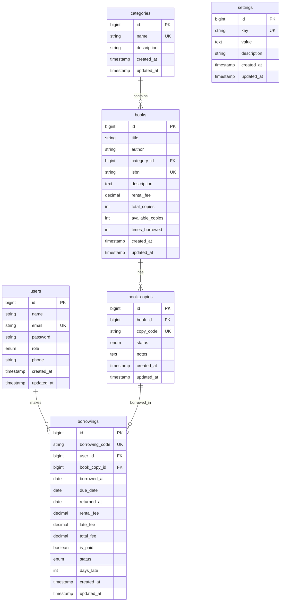

# Database Schema

## Entity Relationship Diagram



---

## Table Definitions

### 1. `users` - User accounts

| Column           | Type                 | Constraints                 | Default | Description       |
| ---------------- | -------------------- | --------------------------- | ------- | ----------------- |
| `id`             | BIGINT UNSIGNED      | PRIMARY KEY, AUTO_INCREMENT | -       | Unique ID         |
| `name`           | VARCHAR(255)         | NOT NULL                    | -       | Full name         |
| `email`          | VARCHAR(255)         | NOT NULL, UNIQUE            | -       | Login email       |
| `password`       | VARCHAR(255)         | NOT NULL                    | -       | Hashed password   |
| `role`           | ENUM('admin','user') | NOT NULL                    | 'user'  | User role         |
| `phone`          | VARCHAR(20)          | NULLABLE                    | NULL    | Phone number      |
| `remember_token` | VARCHAR(100)         | NULLABLE                    | NULL    | Remember me token |
| `created_at`     | TIMESTAMP            | NULLABLE                    | NULL    | Created timestamp |
| `updated_at`     | TIMESTAMP            | NULLABLE                    | NULL    | Updated timestamp |

---

### 2. `categories` - Book categories

| Column        | Type            | Constraints                 | Default | Description       |
| ------------- | --------------- | --------------------------- | ------- | ----------------- |
| `id`          | BIGINT UNSIGNED | PRIMARY KEY, AUTO_INCREMENT | -       | Unique ID         |
| `name`        | VARCHAR(100)    | NOT NULL, UNIQUE            | -       | Category name     |
| `description` | TEXT            | NULLABLE                    | NULL    | Description       |
| `created_at`  | TIMESTAMP       | NULLABLE                    | NULL    | Created timestamp |
| `updated_at`  | TIMESTAMP       | NULLABLE                    | NULL    | Updated timestamp |

---

### 3. `books` - Book master data

| Column             | Type            | Constraints                 | Default | Description           |
| ------------------ | --------------- | --------------------------- | ------- | --------------------- |
| `id`               | BIGINT UNSIGNED | PRIMARY KEY, AUTO_INCREMENT | -       | Unique ID             |
| `title`            | VARCHAR(255)    | NOT NULL                    | -       | Book title            |
| `author`           | VARCHAR(255)    | NOT NULL                    | -       | Author name           |
| `category_id`      | BIGINT UNSIGNED | NOT NULL, FK                | -       | Category ID           |
| `isbn`             | VARCHAR(20)     | NULLABLE, UNIQUE            | NULL    | ISBN number           |
| `description`      | TEXT            | NULLABLE                    | NULL    | Synopsis              |
| `rental_fee`       | DECIMAL(10,2)   | NOT NULL                    | 0.00    | Rental fee per borrow |
| `total_copies`     | INT UNSIGNED    | NOT NULL                    | 0       | Total copies          |
| `available_copies` | INT UNSIGNED    | NOT NULL                    | 0       | Available copies      |
| `times_borrowed`   | INT UNSIGNED    | NOT NULL                    | 0       | Borrow counter        |
| `created_at`       | TIMESTAMP       | NULLABLE                    | NULL    | Created timestamp     |
| `updated_at`       | TIMESTAMP       | NULLABLE                    | NULL    | Updated timestamp     |

**Foreign Keys:** `category_id` → `categories(id)` ON DELETE RESTRICT

---

### 4. `settings` - System settings

| Column        | Type            | Constraints                 | Default | Description       |
| ------------- | --------------- | --------------------------- | ------- | ----------------- |
| `id`          | BIGINT UNSIGNED | PRIMARY KEY, AUTO_INCREMENT | -       | Unique ID         |
| `key`         | VARCHAR(100)    | NOT NULL, UNIQUE            | -       | Setting key       |
| `value`       | TEXT            | NOT NULL                    | -       | Setting value     |
| `description` | VARCHAR(255)    | NULLABLE                    | NULL    | Description       |
| `created_at`  | TIMESTAMP       | NULLABLE                    | NULL    | Created timestamp |
| `updated_at`  | TIMESTAMP       | NULLABLE                    | NULL    | Updated timestamp |

**Default Settings:**

| Key                  | Default Value | Description                       |
| -------------------- | ------------- | --------------------------------- |
| `late_fee_per_day`   | 2000          | Late penalty per day (Rp)         |
| `max_borrow_days`    | 14            | Maximum borrowing duration        |
| `max_books_per_user` | 3             | Max books user can borrow at once |

---

### 5. `book_copies` - Physical book copies

| Column       | Type            | Constraints                 | Default     | Description                         |
| ------------ | --------------- | --------------------------- | ----------- | ----------------------------------- |
| `id`         | BIGINT UNSIGNED | PRIMARY KEY, AUTO_INCREMENT | -           | Unique ID                           |
| `book_id`    | BIGINT UNSIGNED | NOT NULL, FK                | -           | Parent book ID                      |
| `copy_code`  | VARCHAR(50)     | NOT NULL, UNIQUE            | -           | Unique code (e.g., BK001-C01)       |
| `status`     | ENUM            | NOT NULL                    | 'available' | available/borrowed/maintenance/lost |
| `notes`      | TEXT            | NULLABLE                    | NULL        | Condition notes                     |
| `created_at` | TIMESTAMP       | NULLABLE                    | NULL        | Created timestamp                   |
| `updated_at` | TIMESTAMP       | NULLABLE                    | NULL        | Updated timestamp                   |

**Foreign Keys:** `book_id` → `books(id)` ON DELETE CASCADE

---

### 6. `borrowings` - Borrowing transactions

| Column           | Type            | Constraints                 | Default  | Description                   |
| ---------------- | --------------- | --------------------------- | -------- | ----------------------------- |
| `id`             | BIGINT UNSIGNED | PRIMARY KEY, AUTO_INCREMENT | -        | Unique ID                     |
| `borrowing_code` | VARCHAR(50)     | NOT NULL, UNIQUE            | -        | Code (e.g., BRW-20241221-001) |
| `user_id`        | BIGINT UNSIGNED | NOT NULL, FK                | -        | Borrower ID                   |
| `book_copy_id`   | BIGINT UNSIGNED | NOT NULL, FK                | -        | Borrowed copy ID              |
| `borrowed_at`    | DATE            | NOT NULL                    | -        | Borrow date                   |
| `due_date`       | DATE            | NOT NULL                    | -        | Due date                      |
| `returned_at`    | DATE            | NULLABLE                    | NULL     | Return date                   |
| `rental_fee`     | DECIMAL(10,2)   | NOT NULL                    | 0.00     | Rental cost                   |
| `late_fee`       | DECIMAL(10,2)   | NOT NULL                    | 0.00     | Late penalty                  |
| `total_fee`      | DECIMAL(10,2)   | NOT NULL                    | 0.00     | Total (rental + late)         |
| `is_paid`        | BOOLEAN         | NOT NULL                    | FALSE    | Payment status                |
| `status`         | ENUM            | NOT NULL                    | 'active' | active/returned/overdue       |
| `days_late`      | INT             | NOT NULL                    | 0        | Days overdue                  |
| `created_at`     | TIMESTAMP       | NULLABLE                    | NULL     | Created timestamp             |
| `updated_at`     | TIMESTAMP       | NULLABLE                    | NULL     | Updated timestamp             |

**Foreign Keys:**

-   `user_id` → `users(id)` ON DELETE RESTRICT
-   `book_copy_id` → `book_copies(id)` ON DELETE RESTRICT

---

## Recommended Indexes

### Unique Indexes

```sql
ALTER TABLE users ADD UNIQUE INDEX idx_email (email);
ALTER TABLE categories ADD UNIQUE INDEX idx_name (name);
ALTER TABLE books ADD UNIQUE INDEX idx_isbn (isbn);
ALTER TABLE book_copies ADD UNIQUE INDEX idx_copy_code (copy_code);
ALTER TABLE borrowings ADD UNIQUE INDEX idx_borrowing_code (borrowing_code);
```

### Search & Filter Indexes

```sql
ALTER TABLE users ADD INDEX idx_role (role);
ALTER TABLE books ADD INDEX idx_title (title);
ALTER TABLE books ADD INDEX idx_available_copies (available_copies);
ALTER TABLE book_copies ADD INDEX idx_status (status);
ALTER TABLE borrowings ADD INDEX idx_status (status);
ALTER TABLE borrowings ADD INDEX idx_due_date (due_date);
ALTER TABLE borrowings ADD INDEX idx_is_paid (is_paid);
```

### Composite Indexes

```sql
ALTER TABLE book_copies ADD INDEX idx_book_status (book_id, status);
ALTER TABLE borrowings ADD INDEX idx_user_status (user_id, status);
ALTER TABLE borrowings ADD INDEX idx_status_duedate (status, due_date);
```

---

## Storage Estimation

| Table           | Rows   | Avg Row Size | Total Size  |
| --------------- | ------ | ------------ | ----------- |
| users           | 100    | ~500 bytes   | 50 KB       |
| categories      | 20     | ~200 bytes   | 4 KB        |
| books           | 1,000  | ~800 bytes   | 800 KB      |
| book_copies     | 5,000  | ~300 bytes   | 1.5 MB      |
| borrowings      | 10,000 | ~400 bytes   | 4 MB        |
| **Total**       | -      | -            | **~6.5 MB** |
| **+ Indexes**   | -      | -            | **~3 MB**   |
| **Grand Total** | -      | -            | **~10 MB**  |
