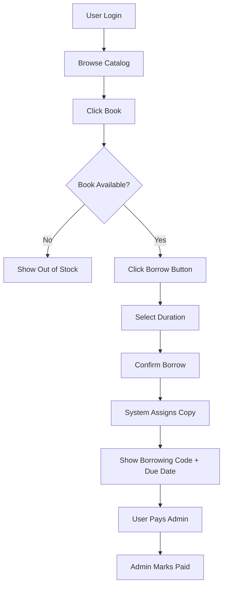
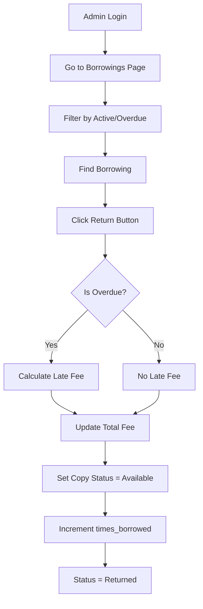
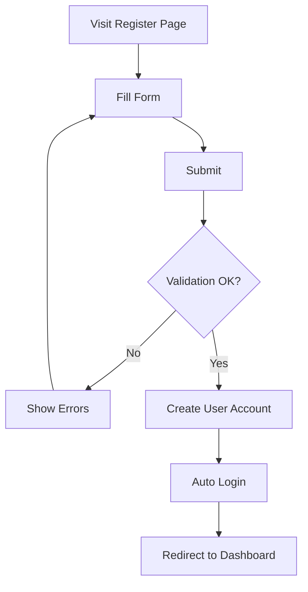
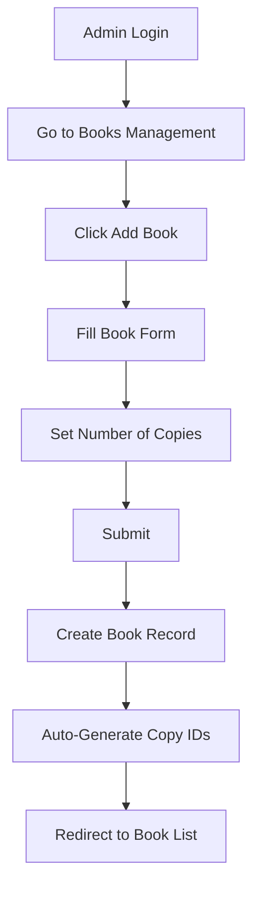
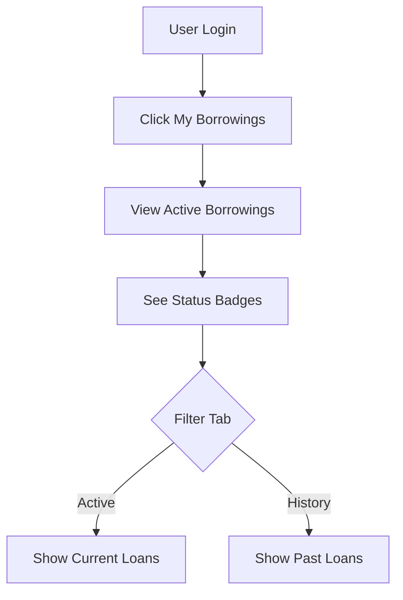

# User Flows

## Flow 1: User Borrows a Book



### Steps Detail

| Step | Action                    | System Response                      |
| ---- | ------------------------- | ------------------------------------ |
| 1    | User logs in              | Redirect to dashboard                |
| 2    | User browses catalog      | Display book list with availability  |
| 3    | User clicks on a book     | Show book detail page                |
| 4    | User clicks "Borrow"      | Show duration selection modal        |
| 5    | User selects 7 or 14 days | Calculate due date                   |
| 6    | User confirms             | System auto-assigns available copy   |
| 7    | Success                   | Display borrowing code + return date |
| 8    | User pays (cash/transfer) | Outside system                       |
| 9    | Admin marks as paid       | Borrowing status updated             |

---

## Flow 2: Admin Processes Book Return



### Steps Detail

| Step | Action                     | System Response                    |
| ---- | -------------------------- | ---------------------------------- |
| 1    | Admin opens Borrowings     | Display all borrowings table       |
| 2    | Admin filters "Active"     | Show only active borrowings        |
| 3    | Admin finds the borrowing  | Search by user name or book        |
| 4    | Admin clicks "Return"      | Prompt confirmation                |
| 5    | System calculates late fee | If overdue, add penalty            |
| 6    | Copy marked available      | `book_copies.status = 'available'` |
| 7    | Counter incremented        | `books.times_borrowed += 1`        |
| 8    | Borrowing closed           | `borrowings.status = 'returned'`   |

---

## Flow 3: User Registration



### Form Fields

| Field            | Required | Validation             |
| ---------------- | -------- | ---------------------- |
| Name             | ✅       | Max 255 chars          |
| Email            | ✅       | Valid email, unique    |
| Password         | ✅       | Min 8 chars            |
| Confirm Password | ✅       | Must match             |
| Phone            | ❌       | Optional, max 20 chars |

---

## Flow 4: Admin Adds New Book



### Copy Code Generation

```
Format: {BOOK_CODE}-C{NUMBER}
Example: If book code is "BK001" with 3 copies:
- BK001-C01
- BK001-C02
- BK001-C03
```

---

## Flow 5: User Views Borrowing History



### Status Badges

| Status   | Color     | Description        |
| -------- | --------- | ------------------ |
| Active   | 🟢 Green  | Currently borrowed |
| Overdue  | 🔴 Red    | Past due date      |
| Returned | 🔵 Blue   | Already returned   |
| Unpaid   | 🟡 Yellow | Payment pending    |

---

## Business Rules Summary

| Rule                | Description                             |
| ------------------- | --------------------------------------- |
| One copy per borrow | User borrows a specific copy            |
| Auto-assign         | System picks first available copy       |
| Duration options    | 7 days or 14 days                       |
| Late fee daily      | Calculated from day after due date      |
| Manual payment      | Admin confirms payment receipt          |
| No reservations     | Users cannot reserve out-of-stock books |
| Single category     | Each book has one category only         |
