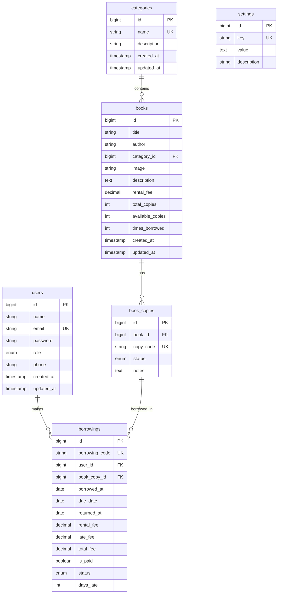

# Sukabaca - Architecture & Database (The Rules)

> Dokumen ini berisi struktur sistem, aturan main, dan schema database. Referensi utama untuk bagaimana sistem dibangun.

---

## 1. Technology Stack

| Layer             | Technology               | Purpose                            |
| ----------------- | ------------------------ | ---------------------------------- |
| **Backend**       | Laravel 11               | PHP framework, routing, logic      |
| **Pattern**       | MVC + Service Repository | Scalable & maintainable code       |
| **Database**      | MySQL                    | Data persistence                   |
| **Auth**          | Laravel Breeze           | Session-based authentication       |
| **Admin Panel**   | Filament v3              | Admin CRUD & dashboard             |
| **Frontend**      | Blade Templates          | Server-side rendering              |
| **Interactivity** | Livewire + Alpine.js     | Reactive components tanpa JS berat |
| **Styling**       | Tailwind CSS             | Utility-first CSS                  |
| **Image Storage** | Local Storage            | `storage/app/public/books/`        |

---

## 2. System Architecture

```
┌──────────────────────────────────────────────────────────────────┐
│                        PRESENTATION LAYER                         │
├──────────────────────────────────────────────────────────────────┤
│  Blade Templates + Livewire                                       │
│  ├── Public Pages (Catalog, Book Detail, Landing)                │
│  ├── User Dashboard (Borrowings, Profile)                        │
│  └── Auth Pages (Login, Register)                                │
│  Tech: Blade, Livewire, Alpine.js, Tailwind CSS                  │
├──────────────────────────────────────────────────────────────────┤
│                        ADMIN PANEL                                │
├──────────────────────────────────────────────────────────────────┤
│  Filament v3                                                      │
│  ├── Dashboard (Stats, Charts, Quick Actions)                    │
│  ├── Resources (Books, Categories, Users, Borrowings)            │
│  └── Settings (System Configuration)                             │
├──────────────────────────────────────────────────────────────────┤
│                       CONTROLLER LAYER                            │
├──────────────────────────────────────────────────────────────────┤
│  Controllers        → Handle HTTP requests                        │
│  ├── Web Controllers    → Blade views                            │
│  ├── Livewire Components → Interactive forms/lists               │
│  └── Form Requests      → Validation                             │
├──────────────────────────────────────────────────────────────────┤
│                         SERVICE LAYER                             │
├──────────────────────────────────────────────────────────────────┤
│  Services           → Business logic                              │
│  ├── BookService                                                  │
│  ├── BorrowingService                                             │
│  ├── UserService                                                  │
│  └── DashboardService                                             │
├──────────────────────────────────────────────────────────────────┤
│                       REPOSITORY LAYER                            │
├──────────────────────────────────────────────────────────────────┤
│  Repositories       → Data access abstraction                     │
│  ├── Contracts/     → Interfaces                                  │
│  └── Eloquent/      → Implementations                             │
├──────────────────────────────────────────────────────────────────┤
│                      INFRASTRUCTURE LAYER                         │
├──────────────────────────────────────────────────────────────────┤
│  MySQL Database  │  Local File Storage  │  Cache (File/Redis)    │
└──────────────────────────────────────────────────────────────────┘
```

---

## 3. Directory Structure

```
app/
├── Contracts/                  # Interfaces
│   └── Repositories/
│       ├── BookRepositoryInterface.php
│       ├── CategoryRepositoryInterface.php
│       ├── BorrowingRepositoryInterface.php
│       ├── UserRepositoryInterface.php
│       └── PaymentRepositoryInterface.php
├── Repositories/               # Data access layer
│   └── Eloquent/
│       ├── BookRepository.php
│       ├── CategoryRepository.php
│       ├── BorrowingRepository.php
│       ├── UserRepository.php
│       └── PaymentRepository.php
├── Services/                   # Business logic
│   ├── BookService.php
│   ├── CategoryService.php
│   ├── BorrowingService.php
│   ├── UserService.php
│   ├── PaymentService.php
│   └── DashboardService.php
├── Http/
│   ├── Controllers/
│   │   ├── AuthController.php
│   │   ├── BookController.php
│   │   ├── BorrowingController.php
│   │   ├── DashboardController.php
│   │   └── ProfileController.php
│   ├── Middleware/
│   └── Requests/               # Form validation
├── Livewire/
│   ├── BookCatalog.php         # Catalog dengan search/filter
│   ├── BookDetail.php          # Book detail + borrow
│   ├── UserBorrowings.php      # User borrowing list
│   └── BorrowModal.php         # Modal konfirmasi pinjam
├── Filament/
│   ├── Resources/
│   │   ├── BookResource.php
│   │   ├── CategoryResource.php
│   │   ├── BorrowingResource.php
│   │   └── UserResource.php
│   ├── Widgets/
│   │   ├── StatsOverview.php
│   │   ├── RecentBorrowings.php
│   │   └── TopBooks.php
│   └── Pages/
│       └── Settings.php
├── Models/                     # Eloquent models
├── Exports/                    # Excel exports
├── Imports/                    # Excel imports
└── Providers/
    └── RepositoryServiceProvider.php

resources/
├── views/
│   ├── layouts/
│   │   └── app.blade.php       # Main layout
│   ├── components/             # Blade components
│   ├── livewire/               # Livewire views
│   ├── pages/
│   │   ├── home.blade.php
│   │   ├── catalog.blade.php
│   │   ├── book-detail.blade.php
│   │   └── dashboard.blade.php
│   └── auth/                   # Login, Register views

database/
├── migrations/
├── seeders/
└── factories/

storage/
└── app/public/
    └── books/                  # Book cover images

routes/
├── web.php                     # Web routes
└── auth.php                    # Auth routes (Breeze)
```

---

## 4. Database Schema

### Entity Relationship Diagram



---

## 5. Table Definitions

### `users` - User accounts

| Column           | Type                 | Constraints        | Default | Description       |
| ---------------- | -------------------- | ------------------ | ------- | ----------------- |
| `id`             | BIGINT UNSIGNED      | PK, AUTO_INCREMENT | -       | Unique ID         |
| `name`           | VARCHAR(255)         | NOT NULL           | -       | Full name         |
| `email`          | VARCHAR(255)         | NOT NULL, UNIQUE   | -       | Login email       |
| `password`       | VARCHAR(255)         | NOT NULL           | -       | Hashed password   |
| `role`           | ENUM('admin','user') | NOT NULL           | 'user'  | User role         |
| `phone`          | VARCHAR(20)          | NULLABLE           | NULL    | Phone number      |
| `remember_token` | VARCHAR(100)         | NULLABLE           | NULL    | Remember me token |

---

### `categories` - Book categories

| Column        | Type            | Constraints        | Default | Description   |
| ------------- | --------------- | ------------------ | ------- | ------------- |
| `id`          | BIGINT UNSIGNED | PK, AUTO_INCREMENT | -       | Unique ID     |
| `name`        | VARCHAR(100)    | NOT NULL, UNIQUE   | -       | Category name |
| `description` | TEXT            | NULLABLE           | NULL    | Description   |

---

### `books` - Book master data

| Column             | Type            | Constraints        | Default | Description           |
| ------------------ | --------------- | ------------------ | ------- | --------------------- |
| `id`               | BIGINT UNSIGNED | PK, AUTO_INCREMENT | -       | Unique ID             |
| `title`            | VARCHAR(255)    | NOT NULL           | -       | Book title            |
| `author`           | VARCHAR(255)    | NOT NULL           | -       | Author name           |
| `category_id`      | BIGINT UNSIGNED | NOT NULL, FK       | -       | Category ID           |
| `image`            | VARCHAR(255)    | NULLABLE           | NULL    | Cover image path      |
| `description`      | TEXT            | NULLABLE           | NULL    | Synopsis              |
| `rental_fee`       | DECIMAL(10,2)   | NOT NULL           | 0.00    | Rental fee per borrow |
| `total_copies`     | INT UNSIGNED    | NOT NULL           | 0       | Total copies          |
| `available_copies` | INT UNSIGNED    | NOT NULL           | 0       | Available copies      |
| `times_borrowed`   | INT UNSIGNED    | NOT NULL           | 0       | Borrow counter        |

**FK:** `category_id` → `categories(id)` ON DELETE RESTRICT

**Image Storage:**

-   Path format: `books/{book_id}_{timestamp}.{ext}`
-   Storage: `storage/app/public/books/`
-   URL: `{APP_URL}/storage/books/{filename}`

---

### `settings` - System settings

| Column        | Type            | Constraints        | Default | Description   |
| ------------- | --------------- | ------------------ | ------- | ------------- |
| `id`          | BIGINT UNSIGNED | PK, AUTO_INCREMENT | -       | Unique ID     |
| `key`         | VARCHAR(100)    | NOT NULL, UNIQUE   | -       | Setting key   |
| `value`       | TEXT            | NOT NULL           | -       | Setting value |
| `description` | VARCHAR(255)    | NULLABLE           | NULL    | Description   |

**Default Settings:**

| Key                  | Default | Description                       |
| -------------------- | ------- | --------------------------------- |
| `late_fee_per_day`   | 2000    | Late penalty per day (Rp)         |
| `max_borrow_days`    | 14      | Maximum borrowing duration        |
| `max_books_per_user` | 3       | Max books user can borrow at once |

---

### `book_copies` - Physical book copies

| Column      | Type            | Constraints        | Default     | Description                         |
| ----------- | --------------- | ------------------ | ----------- | ----------------------------------- |
| `id`        | BIGINT UNSIGNED | PK, AUTO_INCREMENT | -           | Unique ID                           |
| `book_id`   | BIGINT UNSIGNED | NOT NULL, FK       | -           | Parent book ID                      |
| `copy_code` | VARCHAR(50)     | NOT NULL, UNIQUE   | -           | Unique code (e.g., BK001-C01)       |
| `status`    | ENUM            | NOT NULL           | 'available' | available/borrowed/maintenance/lost |
| `notes`     | TEXT            | NULLABLE           | NULL        | Condition notes                     |

**FK:** `book_id` → `books(id)` ON DELETE CASCADE

---

### `borrowings` - Borrowing transactions

| Column           | Type            | Constraints        | Default  | Description                   |
| ---------------- | --------------- | ------------------ | -------- | ----------------------------- |
| `id`             | BIGINT UNSIGNED | PK, AUTO_INCREMENT | -        | Unique ID                     |
| `borrowing_code` | VARCHAR(50)     | NOT NULL, UNIQUE   | -        | Code (e.g., BRW-20241221-001) |
| `user_id`        | BIGINT UNSIGNED | NOT NULL, FK       | -        | Borrower ID                   |
| `book_copy_id`   | BIGINT UNSIGNED | NOT NULL, FK       | -        | Borrowed copy ID              |
| `borrowed_at`    | DATE            | NOT NULL           | -        | Borrow date                   |
| `due_date`       | DATE            | NOT NULL           | -        | Due date                      |
| `returned_at`    | DATE            | NULLABLE           | NULL     | Return date                   |
| `rental_fee`     | DECIMAL(10,2)   | NOT NULL           | 0.00     | Rental cost                   |
| `late_fee`       | DECIMAL(10,2)   | NOT NULL           | 0.00     | Late penalty                  |
| `total_fee`      | DECIMAL(10,2)   | NOT NULL           | 0.00     | Total (rental + late)         |
| `is_paid`        | BOOLEAN         | NOT NULL           | FALSE    | Payment status                |
| `status`         | ENUM            | NOT NULL           | 'active' | active/returned/overdue       |
| `days_late`      | INT             | NOT NULL           | 0        | Days overdue                  |

**FKs:**

-   `user_id` → `users(id)` ON DELETE RESTRICT
-   `book_copy_id` → `book_copies(id)` ON DELETE RESTRICT

---

## 6. Recommended Indexes

### Unique Indexes

```sql
ALTER TABLE users ADD UNIQUE INDEX idx_email (email);
ALTER TABLE categories ADD UNIQUE INDEX idx_name (name);
ALTER TABLE book_copies ADD UNIQUE INDEX idx_copy_code (copy_code);
ALTER TABLE borrowings ADD UNIQUE INDEX idx_borrowing_code (borrowing_code);
```

### Search & Filter Indexes

```sql
ALTER TABLE users ADD INDEX idx_role (role);
ALTER TABLE books ADD INDEX idx_title (title);
ALTER TABLE books ADD INDEX idx_available_copies (available_copies);
ALTER TABLE book_copies ADD INDEX idx_status (status);
ALTER TABLE borrowings ADD INDEX idx_status (status);
ALTER TABLE borrowings ADD INDEX idx_due_date (due_date);
ALTER TABLE borrowings ADD INDEX idx_is_paid (is_paid);
```

### Composite Indexes

```sql
ALTER TABLE book_copies ADD INDEX idx_book_status (book_id, status);
ALTER TABLE borrowings ADD INDEX idx_user_status (user_id, status);
ALTER TABLE borrowings ADD INDEX idx_status_duedate (status, due_date);
```

---

## 7. Key Dependencies

### composer.json

```json
{
    "laravel/framework": "^11.0",
    "laravel/breeze": "^2.0",
    "livewire/livewire": "^3.0",
    "filament/filament": "^3.0"
}
```

### package.json (untuk asset compilation)

```json
{
    "tailwindcss": "^3.0",
    "alpinejs": "^3.0",
    "@tailwindcss/forms": "^0.5",
    "vite": "^5.0",
    "laravel-vite-plugin": "^1.0"
}
```

---

## 8. Environment Configuration

### .env

```env
APP_NAME=Sukabaca
APP_ENV=local
APP_DEBUG=true
APP_URL=http://localhost:8000

DB_CONNECTION=mysql
DB_HOST=127.0.0.1
DB_PORT=3306
DB_DATABASE=sukabaca
DB_USERNAME=root
DB_PASSWORD=

SESSION_DRIVER=file
CACHE_DRIVER=file
QUEUE_CONNECTION=sync

FILESYSTEM_DISK=public
```

---

## 9. Request Flow

```
Browser Request
      │
      ▼
Laravel Router (routes/web.php)
      │
      ├─────────────────────────────────┐
      ▼                                 ▼
Web Controller                    Livewire Component
      │                                 │
      ▼                                 ▼
Service Layer (BookService)       Service Layer
      │                                 │
      ▼                                 ▼
Eloquent Model                    Eloquent Model
      │                                 │
      ▼                                 ▼
MySQL Database                    MySQL Database
      │                                 │
      ▼                                 ▼
Blade Template                    Livewire View
      │                                 │
      └─────────────────────────────────┘
                    │
                    ▼
            HTML Response → Browser
```

### Admin Flow (Filament)

```
Browser Request (/admin/*)
      │
      ▼
Filament Router
      │
      ▼
Filament Resource / Page
      │
      ▼
Eloquent Model
      │
      ▼
MySQL Database
      │
      ▼
Filament View (Auto-generated)
      │
      ▼
HTML Response → Browser
```
