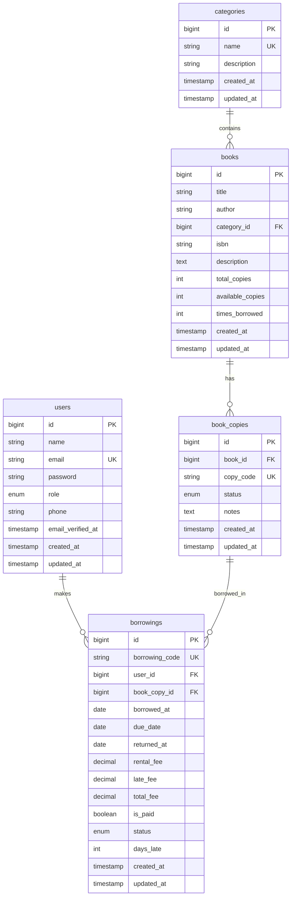

# Sukabaca - Simplified MVP Version

## 1. Core Features (Simple & Essential)

### A. Authentication Module

**Complexity: Low**

**Features:**

-   Login as Admin or User
-   Logout
-   Session management

**Sub-features:**

-   Register new user (name, email, password)
-   Basic profile (name, email, phone number)

---

### B. Book Module (Admin Side)

**Complexity: Medium**

**Main Features:**

-   CRUD books
-   Track book copies
-   Availability status

**Sub-features:**

-   Add book form:
    -   Book title
    -   Author
    -   Category (simple dropdown)
    -   Number of copies (e.g., 10 copies)
-   Each book auto-generates unique ID per copy (Book A-001, Book A-002, etc.)
-   View status per copy:
    -   ✅ Available
    -   📖 Borrowed (by whom, since when)
-   Edit/Delete book
-   Search book (by title or author)

---

### C. Catalog Module (User Side)

**Complexity: Low**

**Main Features:**

-   Browse available books
-   View book details

**Sub-features:**

-   List all books with info:
    -   Title
    -   Author
    -   Category
    -   Available / total copies
    -   Status: "Available" or "Out of Stock"
-   Filter by category
-   Search by title/author
-   Book detail:
    -   Complete info
    -   How many times borrowed (counter)
    -   "Borrow" button (if available)

---

### D. Borrowing Module

**Complexity: Medium**

**Main Features:**

-   User borrows book
-   Admin views who borrowed
-   Return process

**Sub-features:**

-   **User makes a borrow:**
    -   Click "Borrow" on book
    -   Choose duration (e.g., 7 or 14 days)
    -   System automatically assigns available copy
    -   Display borrowing code & return date
-   **User views active borrowings:**
    -   What books are being borrowed
    -   Borrow date & due date
    -   Status: "Active" or "Overdue"
-   **Admin views all borrowings:**
    -   Table: Who | What book | Which copy | Borrow date | Return date | Status
    -   Filter: Active / Returned / Overdue
    -   "Return" button to process return
-   **Return process:**
    -   Admin clicks "Return"
    -   Copy automatically becomes available again
    -   Counter "times borrowed" increases

---

### E. Fees & Fines Module (Simple)

**Complexity: Low**

**Main Features:**

-   Dynamic rental fee per book (each book has its own price)
-   Admin-configurable late fee per day (system setting)
-   Automatic late fee calculation if overdue

**Sub-features:**

-   Book rental fee:
    -   Set individually for each book by admin
    -   Displayed on book detail page
-   System settings (admin configurable):
    -   Late fee per day (e.g., Rp 2,000/day)
    -   Maximum borrow duration
    -   Maximum books per user
-   Automatic calculation:
    -   Total fee = book rental fee + late fee (if any)
    -   Displayed on user borrowing page
-   Manual payment (no payment gateway needed):
    -   User pays cash/transfer
    -   Admin marks as "Paid"

---

### F. Admin Dashboard

**Complexity: Low**

**Features:**

-   Simple statistics:
    -   Total books (titles)
    -   Total copies
    -   Number available
    -   Number currently borrowed
    -   Total registered users
-   Recent borrowings table (last 5-10)
-   Most frequently borrowed books list (top 5)

---

### G. User Dashboard

**Complexity: Low**

**Features:**

-   My active borrowings:
    -   What book
    -   When is due date
    -   Days remaining
    -   Total fee + fines
-   Borrowing history (all books ever borrowed)

---

## 2. Database Schema (Simplified)

### Table: users

-   id, name, email, password, role (admin/user), phone

### Table: categories

-   id, name

### Table: books

-   id, title, author, category_id, rental_fee (dynamic per book), total_copies, times_borrowed (counter)

### Table: settings

-   id, key, value, description (for late_fee_per_day, max_borrow_days, etc.)

### Table: book_copies

-   id, book_id, copy_code (e.g., "BK001-C01"), status (available/borrowed)

### Table: borrowings

-   id, user_id, book_copy_id, borrowed_at, due_date, returned_at, rental_fee, late_fee, paid (boolean), status (active/returned/overdue)

---

## 3. Removed Features (For Simplification)

❌ Book cover upload → later
❌ Email/WA notifications → manual first
❌ Book reservation → not needed yet
❌ Rating/review → skip
❌ Auto-renewal → manual via admin
❌ Multiple categories per book → 1 book = 1 category
❌ Report export → not needed yet
❌ Graphs/charts → numeric stats are enough
❌ Payment proof upload → admin marks manually

---

## 4. Simple User Flow

### User Borrow Book Flow:

1. User login
2. Browse book catalog
3. Click "Borrow" on available book
4. Choose duration (7 or 14 days)
5. Confirm → system auto-assigns copy
6. User gets borrowing code + return date
7. User pays (cash/transfer to admin)
8. Admin marks as "Paid"

### Admin Return Book Flow:

1. Admin goes to "Borrowings" page
2. Find the borrowing to return
3. Click "Return"
4. Copy automatically becomes available
5. Counter "times_borrowed" +1
6. Borrowing status → "Returned"

---

## 5. Time Estimation (Simplified)

| Module                 | Estimate    | Reasoning              |
| ---------------------- | ----------- | ---------------------- |
| Setup Laravel + Auth   | 1 day       | Breeze/Jetstream       |
| Book + Category Master | 2 days      | Simple CRUD            |
| Book Copies Management | 1.5 days    | Generate copy ID       |
| User Catalog           | 1 day       | List + filter + search |
| Borrowing Flow         | 3 days      | Core logic             |
| Fees & Fines           | 1 day       | Simple calculation     |
| Admin Dashboard        | 1 day       | Simple stats           |
| User Dashboard         | 1 day       | History                |
| Testing                | 1.5 days    | Manual testing         |
| **TOTAL**              | **13 days** | **~2.5 weeks**         |

---

## 6. Tech Stack (Simple)

-   **Laravel 11** + **MySQL**
-   **Laravel Breeze** (auth scaffolding)
-   **Laravel Filament** (admin panel CMS)
-   **Blade + Tailwind CSS** (no JS framework)
-   **Alpine.js** (for small interactivity, optional)

---

## 7. Required Pages

### Admin:

1. `/admin/dashboard` - Simple statistics
2. `/admin/books` - CRUD books + view copies
3. `/admin/categories` - CRUD categories
4. `/admin/borrowings` - List all borrowings
5. `/admin/users` - List users (optional)

### User:

1. `/dashboard` - Active borrowings + history
2. `/catalog` - Browse books
3. `/catalog/{id}` - Book detail
4. `/my-borrowings` - My borrowings

---

## 8. "Nice to Have" Features Later (Phase 2)

If client is satisfied with MVP and wants more features:

-   Email reminder notifications
-   Book cover upload
-   Export data to Excel
-   Statistics graphs
-   Advanced filters (by date, status, etc.)
-   Loan extension period

---

## 9. Confirmation Questions for Client

1. **Is rental fee per book the same or different?**
2. **Borrowing duration: fixed (e.g., 7 days) or user can choose?**
3. **Late fee: how much per day?**
4. **Does it need admin approval or can borrow directly?**
5. **How many books can user borrow at once?**
6. **Payment: manual cash/transfer, or need online payment?**

---

## 10. Pricing Recommendation

For a simple MVP like this:

-   **Development**: 13 working days
-   **Laravel freelancer rate**: Rp 300,000 - 600,000/day (depending on experience)
-   **Estimated total**: Rp 3,900,000 - 7,800,000

**Included:**

-   Source code
-   Database setup
-   Basic deployment guide
-   2 weeks bug fixing after delivery

**Not included:**

-   Hosting/server (client provides)
-   Domain
-   SSL certificate
-   Monthly maintenance

---

## Entity Relationship Diagram



---

## Database Schema Documentation

### 1. Table: `users`

Stores user data (admin and borrower users).

| Column              | Data Type            | Constraint                  | Default | Description             |
| ------------------- | -------------------- | --------------------------- | ------- | ----------------------- |
| `id`                | BIGINT UNSIGNED      | PRIMARY KEY, AUTO_INCREMENT | -       | Unique user ID          |
| `name`              | VARCHAR(255)         | NOT NULL                    | -       | Full name               |
| `email`             | VARCHAR(255)         | NOT NULL, UNIQUE            | -       | Login email             |
| `password`          | VARCHAR(255)         | NOT NULL                    | -       | Hashed password         |
| `role`              | ENUM('admin','user') | NOT NULL                    | 'user'  | User role               |
| `phone`             | VARCHAR(20)          | NULLABLE                    | NULL    | Phone number            |
| `email_verified_at` | TIMESTAMP            | NULLABLE                    | NULL    | Email verification time |
| `remember_token`    | VARCHAR(100)         | NULLABLE                    | NULL    | Remember me token       |
| `created_at`        | TIMESTAMP            | NULLABLE                    | NULL    | Created timestamp       |
| `updated_at`        | TIMESTAMP            | NULLABLE                    | NULL    | Updated timestamp       |

**Indexes:**

-   PRIMARY KEY: `id`
-   UNIQUE: `email`
-   INDEX: `role` (for filtering by role)

---

### 2. Table: `categories`

Stores book categories/genres.

| Column        | Data Type       | Constraint                  | Default | Description          |
| ------------- | --------------- | --------------------------- | ------- | -------------------- |
| `id`          | BIGINT UNSIGNED | PRIMARY KEY, AUTO_INCREMENT | -       | Unique category ID   |
| `name`        | VARCHAR(100)    | NOT NULL, UNIQUE            | -       | Category name        |
| `description` | TEXT            | NULLABLE                    | NULL    | Category description |
| `created_at`  | TIMESTAMP       | NULLABLE                    | NULL    | Created timestamp    |
| `updated_at`  | TIMESTAMP       | NULLABLE                    | NULL    | Updated timestamp    |

**Indexes:**

-   PRIMARY KEY: `id`
-   UNIQUE: `name`

---

### 3. Table: `books`

Stores book information (master data).

| Column             | Data Type       | Constraint                  | Default | Description                |
| ------------------ | --------------- | --------------------------- | ------- | -------------------------- |
| `id`               | BIGINT UNSIGNED | PRIMARY KEY, AUTO_INCREMENT | -       | Unique book ID             |
| `title`            | VARCHAR(255)    | NOT NULL                    | -       | Book title                 |
| `author`           | VARCHAR(255)    | NOT NULL                    | -       | Author name                |
| `category_id`      | BIGINT UNSIGNED | NOT NULL, FOREIGN KEY       | -       | Category ID                |
| `isbn`             | VARCHAR(20)     | NULLABLE, UNIQUE            | NULL    | Book ISBN                  |
| `description`      | TEXT            | NULLABLE                    | NULL    | Synopsis/description       |
| `total_copies`     | INT UNSIGNED    | NOT NULL                    | 0       | Total number of copies     |
| `available_copies` | INT UNSIGNED    | NOT NULL                    | 0       | Number of available copies |
| `times_borrowed`   | INT UNSIGNED    | NOT NULL                    | 0       | Counter of times borrowed  |
| `created_at`       | TIMESTAMP       | NULLABLE                    | NULL    | Created timestamp          |
| `updated_at`       | TIMESTAMP       | NULLABLE                    | NULL    | Updated timestamp          |

**Foreign Keys:**

-   `category_id` REFERENCES `categories(id)` ON DELETE RESTRICT

**Indexes:**

-   PRIMARY KEY: `id`
-   UNIQUE: `isbn`
-   INDEX: `category_id` (for joining with categories)
-   INDEX: `title` (for search)
-   INDEX: `available_copies` (for filtering available books)

---

### 4. Table: `book_copies`

Stores data for each physical book copy/exemplar.

| Column       | Data Type                                         | Constraint                  | Default     | Description                        |
| ------------ | ------------------------------------------------- | --------------------------- | ----------- | ---------------------------------- |
| `id`         | BIGINT UNSIGNED                                   | PRIMARY KEY, AUTO_INCREMENT | -           | Unique copy ID                     |
| `book_id`    | BIGINT UNSIGNED                                   | NOT NULL, FOREIGN KEY       | -           | Parent book ID                     |
| `copy_code`  | VARCHAR(50)                                       | NOT NULL, UNIQUE            | -           | Unique copy code (e.g., BK001-C01) |
| `status`     | ENUM('available','borrowed','maintenance','lost') | NOT NULL                    | 'available' | Copy status                        |
| `notes`      | TEXT                                              | NULLABLE                    | NULL        | Notes (condition, etc.)            |
| `created_at` | TIMESTAMP                                         | NULLABLE                    | NULL        | Created timestamp                  |
| `updated_at` | TIMESTAMP                                         | NULLABLE                    | NULL        | Updated timestamp                  |

**Foreign Keys:**

-   `book_id` REFERENCES `books(id)` ON DELETE CASCADE

**Indexes:**

-   PRIMARY KEY: `id`
-   UNIQUE: `copy_code`
-   INDEX: `book_id` (for joining with books)
-   INDEX: `status` (for filtering by status)
-   COMPOSITE INDEX: `(book_id, status)` (for "how many copies available per book" queries)

---

### 5. Table: `borrowings`

Stores book borrowing transaction data.

| Column           | Data Type                           | Constraint                  | Default  | Description                             |
| ---------------- | ----------------------------------- | --------------------------- | -------- | --------------------------------------- |
| `id`             | BIGINT UNSIGNED                     | PRIMARY KEY, AUTO_INCREMENT | -        | Unique borrowing ID                     |
| `borrowing_code` | VARCHAR(50)                         | NOT NULL, UNIQUE            | -        | Borrowing code (e.g., BRW-20241221-001) |
| `user_id`        | BIGINT UNSIGNED                     | NOT NULL, FOREIGN KEY       | -        | Borrower user ID                        |
| `book_copy_id`   | BIGINT UNSIGNED                     | NOT NULL, FOREIGN KEY       | -        | Borrowed copy ID                        |
| `borrowed_at`    | DATE                                | NOT NULL                    | -        | Borrow date                             |
| `due_date`       | DATE                                | NOT NULL                    | -        | Due date                                |
| `returned_at`    | DATE                                | NULLABLE                    | NULL     | Return date (NULL if not yet returned)  |
| `rental_fee`     | DECIMAL(10,2)                       | NOT NULL                    | 0.00     | Rental fee                              |
| `late_fee`       | DECIMAL(10,2)                       | NOT NULL                    | 0.00     | Late fee penalty                        |
| `total_fee`      | DECIMAL(10,2)                       | NOT NULL                    | 0.00     | Total fee (rental + late fee)           |
| `is_paid`        | BOOLEAN                             | NOT NULL                    | FALSE    | Payment status                          |
| `status`         | ENUM('active','returned','overdue') | NOT NULL                    | 'active' | Borrowing status                        |
| `days_late`      | INT                                 | NOT NULL                    | 0        | Number of days late                     |
| `created_at`     | TIMESTAMP                           | NULLABLE                    | NULL     | Created timestamp                       |
| `updated_at`     | TIMESTAMP                           | NULLABLE                    | NULL     | Updated timestamp                       |

**Foreign Keys:**

-   `user_id` REFERENCES `users(id)` ON DELETE RESTRICT
-   `book_copy_id` REFERENCES `book_copies(id)` ON DELETE RESTRICT

**Indexes:**

-   PRIMARY KEY: `id`
-   UNIQUE: `borrowing_code`
-   INDEX: `user_id` (for "borrowings by user" queries)
-   INDEX: `book_copy_id` (for "who borrowed this copy" queries)
-   INDEX: `status` (for filtering by status)
-   INDEX: `due_date` (for "borrowings due soon" queries)
-   INDEX: `is_paid` (for payment queries)
-   COMPOSITE INDEX: `(user_id, status)` (for "user's active borrowings" queries)
-   COMPOSITE INDEX: `(status, due_date)` (for "overdue borrowings" queries)

---

## Table Relationship Explanations

### 1. `users` → `borrowings` (One-to-Many)

**Relationship:** One user can make many borrowings.

**Foreign Key:** `borrowings.user_id` → `users.id`

**ON DELETE:** RESTRICT (user cannot be deleted if they have borrowing history)

**Use Case:**

-   View all borrowings by a specific user
-   See who borrowed a specific book

---

### 2. `categories` → `books` (One-to-Many)

**Relationship:** One category can have many books.

**Foreign Key:** `books.category_id` → `categories.id`

**ON DELETE:** RESTRICT (category cannot be deleted if books are still using it)

**Use Case:**

-   Filter books by category
-   View all books in a specific category

---

### 3. `books` → `book_copies` (One-to-Many)

**Relationship:** One book can have many physical copies.

**Foreign Key:** `book_copies.book_id` → `books.id`

**ON DELETE:** CASCADE (if book is deleted, all its copies are also deleted)

**Use Case:**

-   View all copies of a specific book
-   Check copy availability per book

---

### 4. `book_copies` → `borrowings` (One-to-Many)

**Relationship:** One copy can be borrowed multiple times (but not simultaneously).

**Foreign Key:** `borrowings.book_copy_id` → `book_copies.id`

**ON DELETE:** RESTRICT (copy cannot be deleted if there's borrowing history)

**Use Case:**

-   View borrowing history of a copy
-   Check if copy is currently borrowed

---

## Common Queries

### Query 1: Book catalog with availability info

```sql
SELECT
    b.id,
    b.title,
    b.author,
    c.name as category,
    b.available_copies,
    b.total_copies,
    b.times_borrowed
FROM books b
JOIN categories c ON b.category_id = c.id
WHERE b.available_copies > 0
ORDER BY b.title;
```

---

### Query 2: User's active borrowings

```sql
SELECT
    br.borrowing_code,
    b.title,
    bc.copy_code,
    br.borrowed_at,
    br.due_date,
    br.total_fee,
    br.is_paid,
    CASE
        WHEN br.due_date < CURDATE() THEN 'overdue'
        ELSE 'active'
    END as status
FROM borrowings br
JOIN book_copies bc ON br.book_copy_id = bc.id
JOIN books b ON bc.book_id = b.id
WHERE br.user_id = ? AND br.status IN ('active', 'overdue')
ORDER BY br.due_date;
```

---

### Query 3: All borrowings (Admin view)

```sql
SELECT
    br.borrowing_code,
    u.name as borrower,
    b.title as book_title,
    bc.copy_code,
    br.borrowed_at,
    br.due_date,
    br.status,
    br.is_paid
FROM borrowings br
JOIN users u ON br.user_id = u.id
JOIN book_copies bc ON br.book_copy_id = bc.id
JOIN books b ON bc.book_id = b.id
WHERE br.status = 'active'
ORDER BY br.due_date;
```

---

### Query 4: Most borrowed books (Top 5)

```sql
SELECT
    b.title,
    b.author,
    b.times_borrowed,
    c.name as category
FROM books b
JOIN categories c ON b.category_id = c.id
ORDER BY b.times_borrowed DESC
LIMIT 5;
```

---

### Query 5: Check overdue borrowings

```sql
SELECT
    br.borrowing_code,
    u.name as borrower,
    u.phone,
    b.title,
    br.borrowed_at,
    br.due_date,
    DATEDIFF(CURDATE(), br.due_date) as days_overdue
FROM borrowings br
JOIN users u ON br.user_id = u.id
JOIN book_copies bc ON br.book_copy_id = bc.id
JOIN books b ON bc.book_id = b.id
WHERE br.status = 'active' AND br.due_date < CURDATE()
ORDER BY br.due_date;
```

---

## Query Optimization Tips

1. **Use EXPLAIN** to analyze queries:

```sql
EXPLAIN SELECT * FROM borrowings WHERE user_id = 5 AND status = 'active';
```

2. **Avoid SELECT \*** in production, select only needed columns.

3. **Use pagination** for long lists:

```sql
SELECT * FROM books LIMIT 20 OFFSET 0;
```

4. **Cache frequently used queries** (e.g., dashboard statistics).

5. **Regularly analyze & optimize tables:**

```sql
ANALYZE TABLE borrowings;
OPTIMIZE TABLE borrowings;
```

---

## Storage Estimation

Assumptions: 1000 books, 5000 copies, 100 users, 10,000 borrowings

| Table           | Rows   | Avg Row Size | Total Size  |
| --------------- | ------ | ------------ | ----------- |
| users           | 100    | ~500 bytes   | 50 KB       |
| categories      | 20     | ~200 bytes   | 4 KB        |
| books           | 1000   | ~800 bytes   | 800 KB      |
| book_copies     | 5000   | ~300 bytes   | 1.5 MB      |
| borrowings      | 10,000 | ~400 bytes   | 4 MB        |
| **Total**       | -      | -            | **~6.5 MB** |
| **+ Indexes**   | -      | -            | **~3 MB**   |
| **Grand Total** | -      | -            | **~10 MB**  |

Database size is very small, no performance issues for small-medium scale applications.

---

**This database design is already optimal for Sukabaca use case!** 🚀
